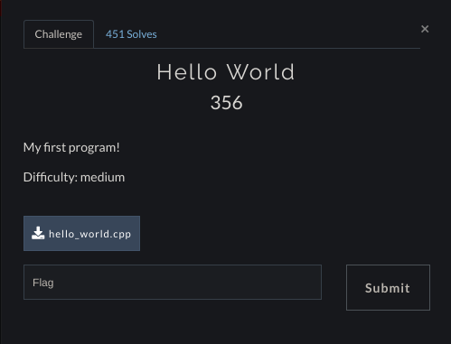
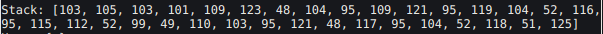

# Hello World!(Misc)
## Description

Difficulty: Medium

Category: Misc

## Writeup

This challenge was an easy level challenge if someone noticed those strange spaces in the HelloWorld.cpp file. Yea those were Whitespaces(an estoric language). At first it was an easy looking challenge n it was. Decoding the whitespace gave us a strange output which certainly was not the flag.
So using an online whitespace decoder, there was a tab of stack looking at which revealed some ascii codes which made a string i.e our FLAG :P

## gigem{0h_my_wh4t_sp4c1ng_y0u_h4v3}
